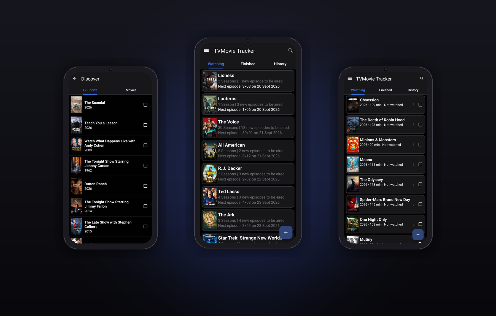
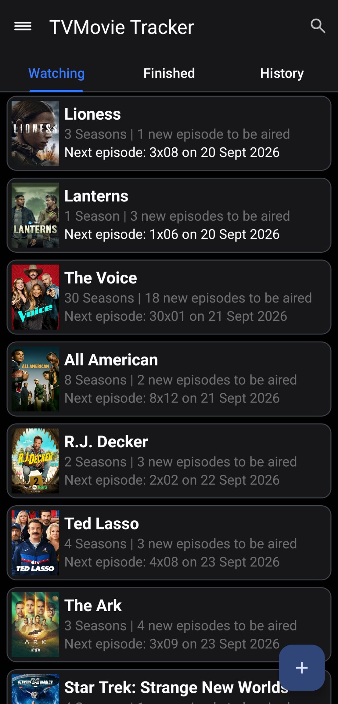
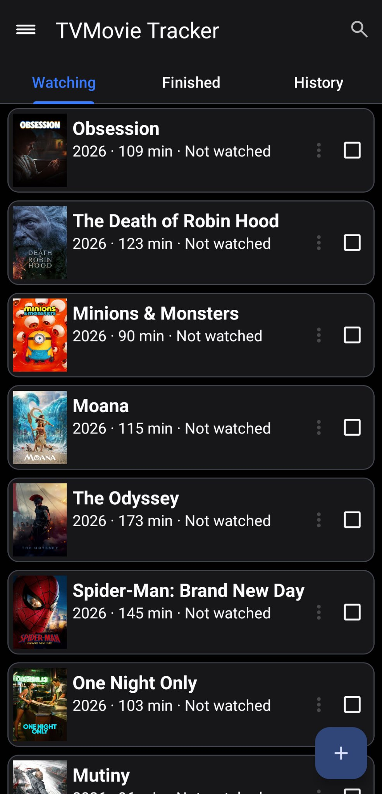
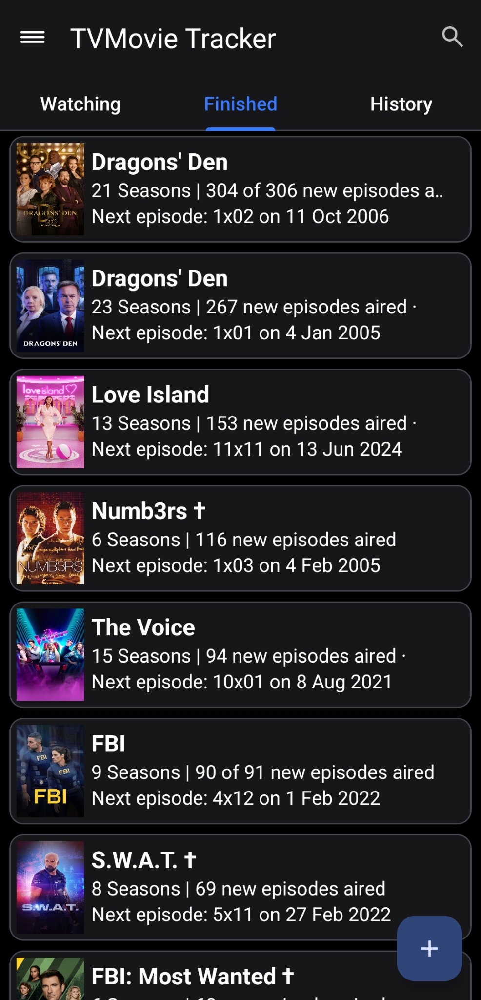
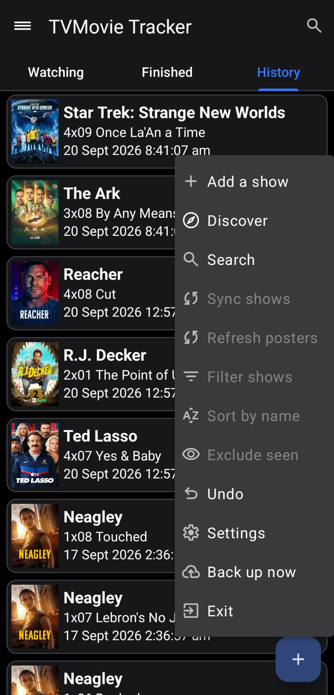
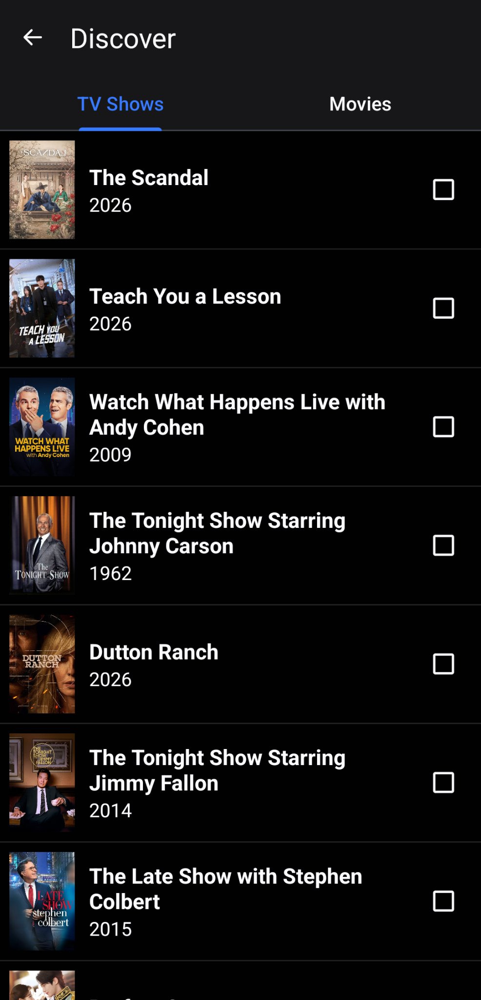
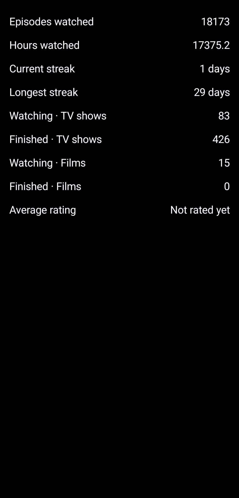
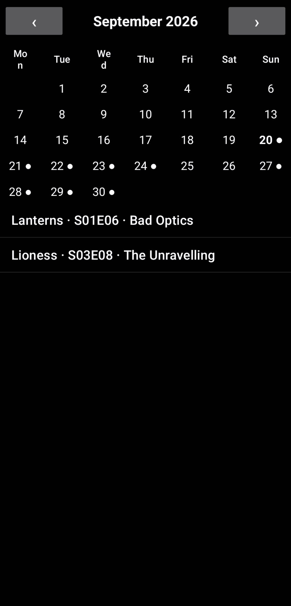
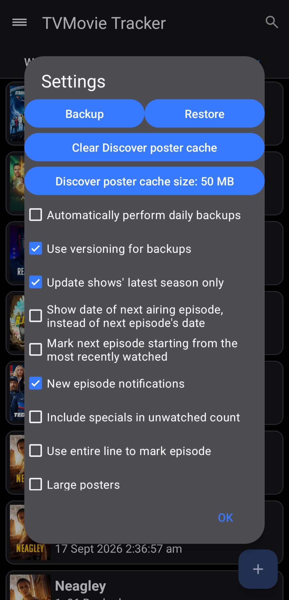

# TV Movie Tracker

**Every show. Every film. Right where you left off.**

TV Movie Tracker is the Android app for people who take their watching seriously.
Track TV shows and films across **Watching**, **Finished** and **History**,
get told when new episodes air, and discover what to watch next — all in one
fast, private, offline-first app. No account, no cloud, no ads. Your library
lives on your device.

## Screenshots

| Watching – TV | Watching – Movies | Finished | History |
|---|---|---|---|
|  |  |  |  |

| Discover | Statistics | Calendar | Settings |
|---|---|---|---|
|  |  |  |  |

## Features

- **TV shows, powered by TVMaze** — search and add any series; no API key needed.
- **Movies, powered by TMDB** — your personal film library with posters and details.
- **Watching / Finished / History** — separate tabs for shows and films, so your
  in-progress series never get buried under films you've finished.
- **Discover** — browse trending and top-rated shows and films, read the synopsis,
  add anything to your library with a single tap.
- **New-episode notifications** — a daily check plus alerts after every sync, one
  per show, so you never miss a premiere.
- **Up Next widget** — your next unwatched episode for every show, right on your
  home screen.
- **Where to watch** — streaming and rental options in your region, on every
  details screen.
- **Statistics** — episodes and hours watched, current and longest streaks,
  library counts and your average personal rating.
- **Calendar** — a month view dotted with air dates; tap any day to see what's on.
- **Personal ratings** — five stars in half steps, shown beside the online score.
- **Fast by design** — thin non-blocking progress indicators keep the app usable
  while syncs run; posters load smoothly and live in permanent storage, never in
  the disposable cache.
- **Swipe actions** — swipe right to archive, left to mark watched, keep swiping
  to hop between tabs.
- **Backup & restore** — one tap backs up your whole library; restore it on any
  device.
- **Your look** — Automatic, Light and Dark themes with Material You dynamic
  colours on Android 12+, plus a true-black AMOLED mode.
- **Seven languages** — English, German, Spanish, French, Italian, Dutch, Russian.

## Installation

Requires **Android 5.0 (API 21)** or newer.

Download the APK from the
**[latest release](https://github.com/steps2/tvmovietracker/releases/latest)** —
it installs over any previous 1.x version.

- **TV shows** work out of the box — TVMaze needs no key.
- **Movies** need a free TMDB API key: create one at
  [themoviedb.org](https://www.themoviedb.org/settings/api) and paste it into
  the app's Settings.

## Migrating from DroidShows

Coming from the original DroidShows or an older beta? In the old app choose
**Back up now** from the menu, install TV Movie Tracker, then restore the backup
file. Your shows, history and ratings come along.

## History

TV Movie Tracker stands on the shoulders of a long line of open-source TV
trackers:

- **2010** — *droidseries* by C. Limpinho and P. Cabido (Google Code) starts it all.
- *droidseries* is carried forward by M. Berthe.
- **2014** — Guillaume (ltGuillaume) builds **DroidShows** on that foundation and
  releases it under the GPL-3.0 on XDA.
- The years pass, and TheTVDB's v1 API — the heart DroidShows depended on — goes
  dark. Shows can no longer be added; the app slowly stops working.
- **2026** — the project is forked, the show backend is migrated to **TVMaze**,
  a full **movie** library backed by **TMDB** is added, and the whole app is
  rebuilt with a modern Material 3 interface. Reborn as **TV Movie Tracker**.

The spirit is unchanged: a tracker that respects your data and gets out of your
way — now built to last.

## Credits

- **TVMaze** ([tvmaze.com](https://www.tvmaze.com)) — TV show data, free for everyone.
- **TMDB** ([themoviedb.com](https://www.themoviedb.org)) — movie data, posters
  and where-to-watch information. *This product uses the TMDB API but is not
  endorsed or certified by TMDB.*
- [**ltGuillaume**](https://github.com/ltguillaume), [C. Limpinho](https://github.com/ltguillaume/droidseries), [P. Cabido](https://github.com/ltguillaume/droidseries) and [**M. Berthe**](https://github.com/McKael) — for [DroidShows](https://github.com/ltguillaume/droidshows) and the
  [droidseries](https://github.com/ltguillaume/droidseries) lineage this app grew from.
- **App icon** — a mix of work by Thrasos Varnava
  ([iconeasy.com](https://www.iconeasy.com)) and Taenggo
  ([wallalay.com](https://www.wallalay.com)); Material icon by Listy2021 and
  ltGuillaume.

## Licence

TV Movie Tracker is free software released under the
**GNU General Public License v3.0** — see [LICENSE](LICENSE).
